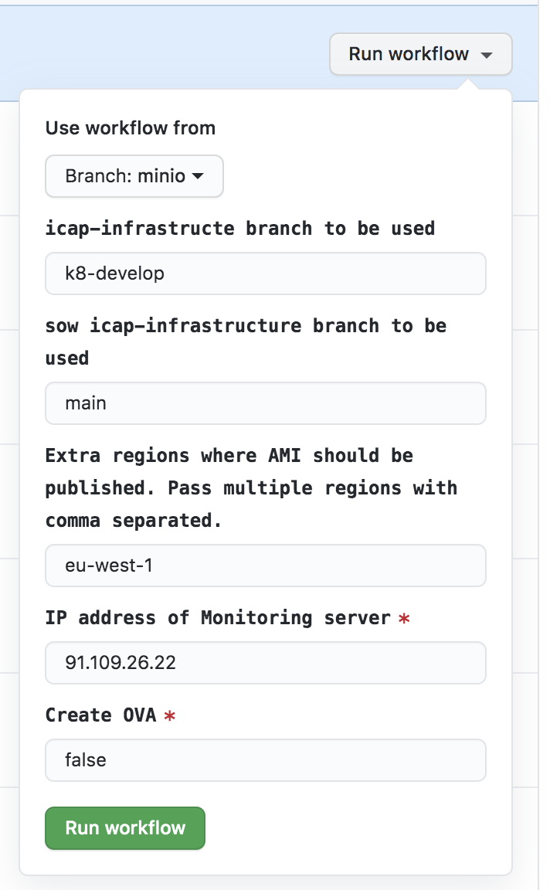
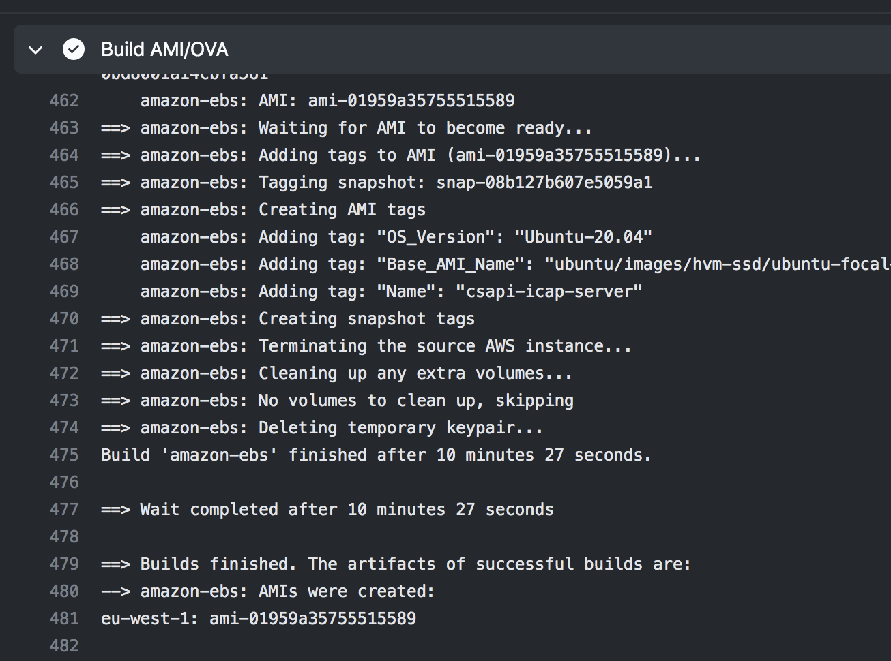

<h1 align="center">k8-go-infra</h1>

<p align="center">
    <a href="https://github.com/k8-proxy/go-k8s-infra/actions/workflows/build.yml">
        
    </a>
	<a href="https://github.com/k8-proxy/go-k8s-infra/pulls">
        
    </a>
    <a href="https://opensource.org/licenses/Apache-2.0">
        
    </a>
</p>


# go-k8-infra
Go based Kubernetes infrastructure, providing an ICAP based solution to process files through Glasswall CDR engine.

The work here is a continuation and enhancement over: https://github.com/k8-proxy/icap-infrastructure).

## Version v0.x:

### Solution diagram

### Enhancements
The solution provides the following enhancements:
- Using MinIO instead of local storage for the processing pods.
- Implementing process pods hot reload feature.


### Components
The solution consists of the following components:
- [Service 1](https://github.com/k8-proxy/go-k8s-srv)
- [Processing Service.](https://github.com/k8-proxy/go-k8s-process)
- [Controller Service.](https://github.com/k8-proxy/go-k8s-controller)
- Components related to ICAP server, RabbitMQ, transaction logs , Management UI and similar (From here: https://github.com/k8-proxy/icap-infrastructure).

###
VM configuration needed for this setup to run smoothly 
- 4 vCPU
- 4 GB RAM
- 50 GB Storage volume

On aws recommended instance type 
- t2.xlarge

Perform following steps with sudo user 
```
sudo su
```

## Development Setup
- Install k8s

```
if [ -f ./flush_ip.sh ] ; then
chmod +x ./flush_ip.sh
./flush_ip.sh
fi
```

```
curl -sfL https://get.k3s.io | sh -
mkdir -p ~/.kube && sudo install -T /etc/rancher/k3s/k3s.yaml ~/.kube/config -m 600 -o $USER
```
- Install helm
```
curl -sfL https://raw.githubusercontent.com/helm/helm/master/scripts/get-helm-3 | bash

```

- Install kubectl

```
curl -LO "https://storage.googleapis.com/kubernetes-release/release/$(curl -s https://storage.googleapis.com/kubernetes-release/release/stable.txt)/bin/linux/amd64/kubectl"
chmod +x ./kubectl
sudo mv ./kubectl /usr/local/bin/kubectl
```

- Deploy icap-server

```
cd ~
ICAP_BRANCH=${ICAP_BRANCH:-k8-develop}
git clone https://github.com/k8-proxy/icap-infrastructure.git -b $ICAP_BRANCH && cd icap-infrastructure
```
```
# Clone ICAP SOW Version

ICAP_SOW_BRANCH=${ICAP_SOW_BRANCH:-main}
git clone https://github.com/filetrust/icap-infrastructure.git -b $ICAP_SOW_BRANCH /tmp/icap-infrastructure-sow
cp  /tmp/icap-infrastructure-sow/adaptation/values.yaml adaptation/
cp  /tmp/icap-infrastructure-sow/administration/values.yaml administration/
cp  /tmp/icap-infrastructure-sow/ncfs/values.yaml ncfs/
```
```
# Admin ui default credentials
sudo mkdir -p /var/local/rancher/host/c/userstore
sudo cp -r default-user/* /var/local/rancher/host/c/userstore/
```
```
# Create namespaces
kubectl create ns icap-adaptation
kubectl create ns management-ui
kubectl create ns icap-ncfs
kubectl create ns minio
kubectl create ns jaeger
```
```
# Install minio 
helm repo add minio https://helm.min.io/
helm install --set accessKey=<minio-user>,secretKey=<minio-password> minio-server minio/minio --namespace minio
```
```
# install docker registry credentials
kubectl create -n icap-adaptation secret docker-registry regcred \
	--docker-server=https://index.docker.io/v1/ \
	--docker-username=$DOCKER_USERNAME \
	--docker-password=$DOCKER_PASSWORD \
	--docker-email=$DOCKER_EMAIL
```
```
# Setup rabbitMQ
pushd rabbitmq && helm upgrade rabbitmq --install . --namespace icap-adaptation && popd
```
```
# Setup icap-server
cat >> openssl.cnf <<EOF
[ req ]
prompt = no
distinguished_name = req_distinguished_name
[ req_distinguished_name ]
C = GB
ST = London
L = London
O = Glasswall
OU = IT
CN = icap-server
emailAddress = admin@glasswall.com
EOF

openssl req -newkey rsa:2048 -config openssl.cnf -nodes -keyout  /tmp/tls.key -x509 -days 365 -out /tmp/certificate.crt
kubectl create secret tls icap-service-tls-config --namespace icap-adaptation --key /tmp/tls.key --cert /tmp/certificate.crt
```
```
pushd adaptation
kubectl create -n icap-adaptation secret generic policyupdateservicesecret --from-literal=username=policy-management --from-literal=password='long-password'
kubectl create -n icap-adaptation secret generic transactionqueryservicesecret --from-literal=username=query-service --from-literal=password='long-password'
kubectl create -n icap-adaptation secret generic  rabbitmq-service-default-user --from-literal=username=guest --from-literal=password='guest'
helm upgrade adaptation --values custom-values.yaml --install . --namespace icap-adaptation
popd
```
```
# Setup icap policy management
pushd ncfs
kubectl create -n icap-ncfs secret generic ncfspolicyupdateservicesecret --from-literal=username=policy-update --from-literal=password='long-password'
helm upgrade ncfs --values custom-values.yaml --install . --namespace icap-ncfs
popd
```
```
# setup management ui
kubectl create -n management-ui secret generic transactionqueryserviceref --from-literal=username=query-service --from-literal=password='long-password'
kubectl create -n management-ui secret generic policyupdateserviceref --from-literal=username=policy-management --from-literal=password='long-password'
kubectl create -n management-ui secret generic ncfspolicyupdateserviceref --from-literal=username=policy-update --from-literal=password='long-password'
```
```
pushd administration
helm upgrade administration --values custom-values.yaml --install . --namespace management-ui
popd
```
```
cd ~
```
```
# Clone go-k8s-infra repo
git clone https://github.com/k8-proxy/go-k8s-infra.git -b develop && cd go-k8s-infra
```
- Scale the existing adaptation service to 0
```
kubectl -n icap-adaptation scale --replicas=0 deployment/adaptation-service
```
```
# Install k8s-dashboard
kubectl apply -f k8s-dash
```
# Install jaeger-agent
cd jaeger-agent
kubectl apply -f jaeger.yaml
```
- Create minio credentials secret
```
kubectl create -n icap-adaptation secret generic minio-credentials --from-literal=username='<minio-user>' --from-literal=password='<minio-password>'
```

- Apply helm chart to create the services
```
cd ../services
helm upgrade servicesv2 --install . --namespace icap-adaptation
```

- Create bucket on minio by accessing the minio console
```
export POD_NAME=$(kubectl get pods --namespace minio -l "release=minio-server" -o jsonpath="{.items[0].metadata.name}")

kubectl port-forward $POD_NAME 9000 --namespace minio

go to browser and access the minio console with http://127.0.0.1:9000 / http://machine-ip:9000 

and credentails is accesskey and secret you have pass when deploying minio .
once you are in minio UI create an bucket 1) sourcefiles and 2) cleanfiles
```
- Process the Pdf file and check the logs of minio 
```
c-icap-client -i <Icap-server-ip/machine-ip> -p 1344 -s gw_rebuild -f ./sample.pdf -o ./reb.pdf -v

# check logs of service deploy in icap-adaptation namespace

kubectl logs -f <pod-name> -n icap-adaptation
ex: kubectl logs -f srv-94fd6cc74-bqjhs -n icap-adaptation
```

```
# get access token for kubernetes dashboard
kubectl get secret 
kubectl describe secret skooner-sa-token-xxxxx
```
## Production Setup

* Latest ICAP AMI without DSK API : ami-08eb467551ac8b5d6

* Icap AMI with SDK API : ami-0874e365dfffd43d0


- Login to aws console https://aws.amazon.com/console/

- Go to EC2 service.

- Choose Ireland, "eu-west-1" region

- Search for "AMI" under "Images" by entering the ami above

- Click on "Launch" button

- Select below configarature for next steps (available on bottom right corner):
        
    - Choose Instance Type         :     t2.2xlarge 
    - Configure Instance Details   :     The amount of requested instances 
    - Add Storage (disk space)     :     At least 50G
    - Add Tags                     :     Put the vm tags
    - Configure Security Group     :     Choose to select from existing groups, and select *launch-wizard-8*
                           
- Once you verify above details, `LAUNCH` the instance. You will be prompt to enter privet key. Choose existing or create a new pem file.
    
- Wait untill the instance goes to running state

- Get the Public IP of the instance

## How to Create AMI
### Workflow

- Create the ami is done by triggering the icap-server(https://github.com/k8-proxy/GW-Releases/actions?query=workflow%3Aicap-server) workflow

- There are 2 main jobs for that workflow:
    - build-ami
        - Configure AWS credentials
        - Setup Packer
        - Build AMI 

    
    
    - deploy-ami
        - Get current instance ID
        - Deploy AMI to dev
        - Run tests on instance
        - Delete instance(s) that fail

    

### Workflow Requirements
    - branch to use workflow from
    - AWS region(s) where AMI will be created
    - IP of monitoring server


### Workflow Detail
- [YAML File](https://github.com/k8-proxy/GW-Releases/blob/main/.github/workflows/icap-server.yaml) 
- build AMI
    - Configure AWS credentials
    - Setup [Packer](https://github.com/k8-proxy/vmware-scripts/tree/main/packer)
    - Build AMI using Packer 
- deploy AMI
    - Get current instance ID and other instance IDs with the same name as current instance
    - Deploy the instance
    - Run [healthcheck tests](https://github.com/k8-proxy/vmware-scripts/tree/f129ec357284c61206edf36415b1b2ba403bff95/HealthCheck) on the instance
        - if tests are successful for current instance, all previous instances are terminated
        - if tests are failed, current instance is terminated and deleted

### Execution
- Open the link https://github.com/k8-proxy/GW-Releases/actions/workflows/icap-server.yaml
- If you are creating an AMI with SDK, select the branch : minio-with-sdk , if you are creating icap ami without sdk api select branch minio
- Click on "Run workflow" as on the screenshot

- Once it's completed the AMI will be available in the logs


## Test

For testing, try to rebuild a file
